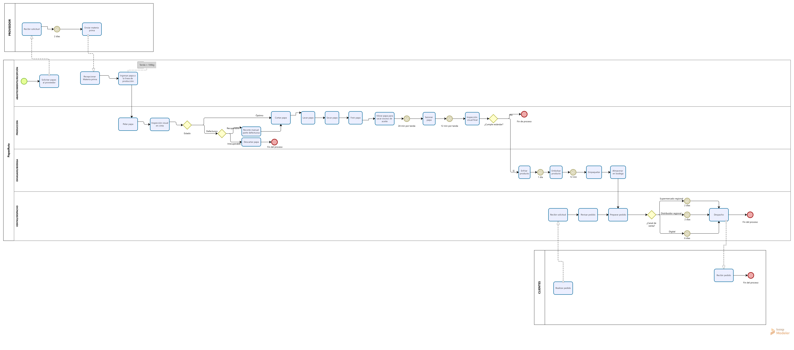
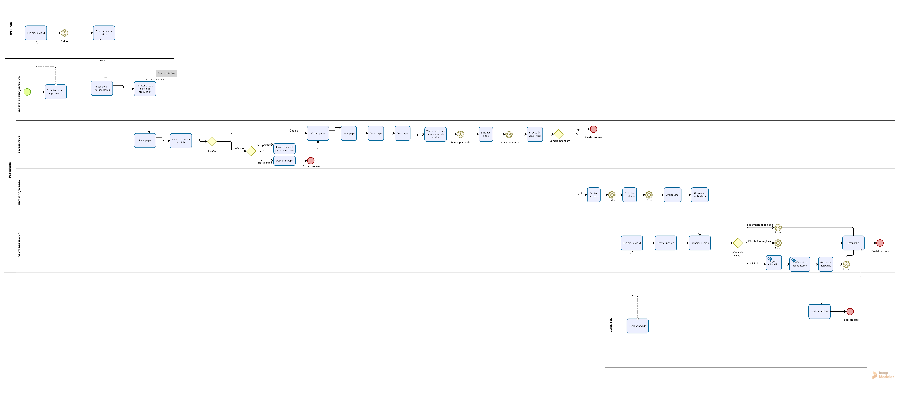

# Sección D: Modelado de Procesos de Negocio (BPMN) - Papas Fritas RUTA

## 1. Proceso Actual (AS-IS)

---

## 2. Proceso Rediseñado (TO-BE)

---

## 3. Principales Mejoras y Comparación de Tiempos

* Registro automático: se incorpora el registro automático de los pedidos, reduciendo la dependencia del manejo manual de la información.
* Notificación al responsable: se incorpora una notificación para apoyar el seguimiento oportuno de los pedidos.
* Gestión y priorización de pedidos: el proceso TO-BE permite un mayor control de los pedidos pendientes y facilita su priorización según antigüedad.
* Reducción del tiempo de preparación: el proceso AS-IS presenta un tiempo de preparación de 6 días, mientras que en el TO-BE se establece una meta de 2 días.
