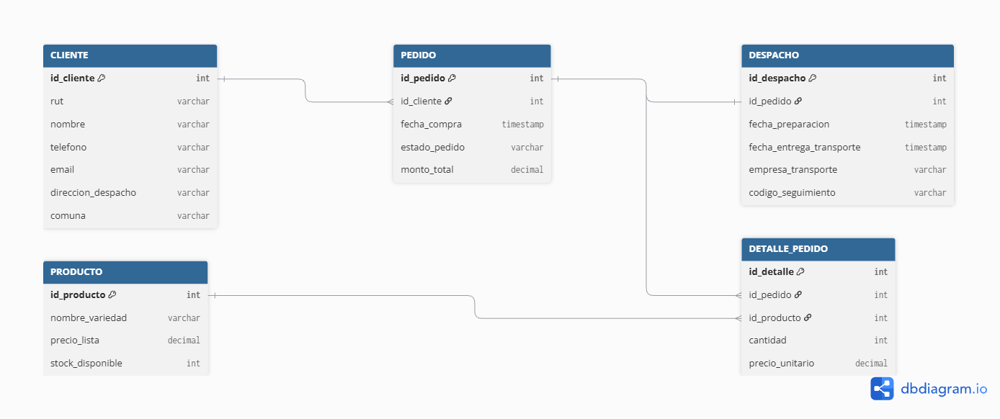

# Sección E y F: Modelo Entidad-Relación y Stack Tecnológico - Papas Fritas RUTA

## 1. Modelo Entidad-Relación Preliminar

---

## 2. Descripción de Entidades Principales y Claves

* 
* 
* 
* 

---

## 3. Trazabilidad entre Datos y Proceso TO-BE

* 
* 
* 

---

## 4. Arquitectura lógica y stack tentativo

* 
* 
* 
* 
